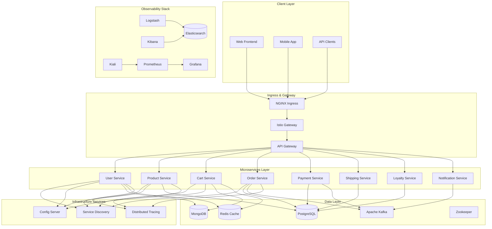
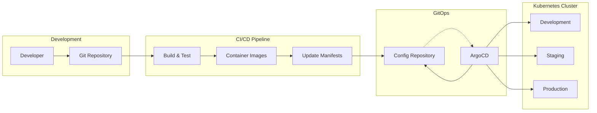
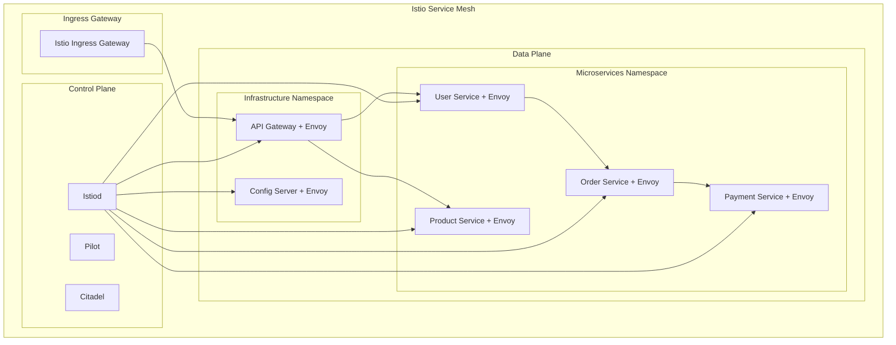
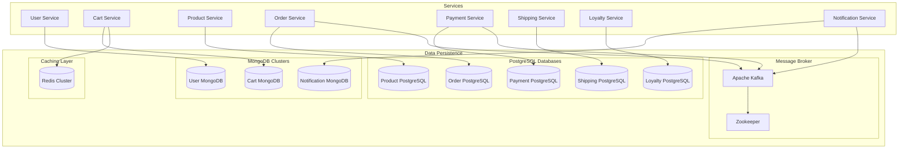
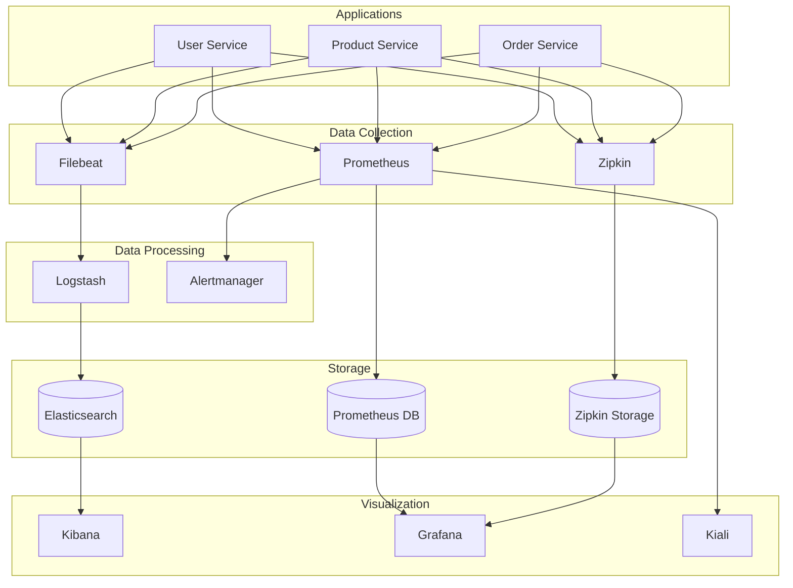

# 🛒 NexusCommerce Microservices Platform

<div align="center">


**A cloud-native, scalable e-commerce microservices platform built with GitOps principles**

[🚀 Quick Start](#-quick-start) • [📖 Documentation](#-documentation) • [🏗️ Architecture](#️-architecture) • [🔧 Configuration](#-configuration)

</div>

---

## 📋 Table of Contents

- [Overview](#-overview)
- [Architecture](#️-architecture)
- [Features](#-features)
- [Prerequisites](#-prerequisites)
- [Quick Start](#-quick-start)
- [Project Structure](#-project-structure)
- [Services](#-services)
- [Infrastructure](#-infrastructure)
- [Monitoring & Observability](#-monitoring--observability)
- [Development](#-development)
- [Production Deployment](#-production-deployment)
- [Contributing](#-contributing)
- [License](#-license)

---

## 🌟 Overview

NexusCommerce is a modern, cloud-native e-commerce platform built using microservices architecture and deployed with GitOps principles using ArgoCD. The platform demonstrates best practices for building scalable, resilient, and observable distributed systems.

### 🎯 Key Highlights

- **🔄 GitOps Workflow**: Fully automated deployments with ArgoCD
- **🕸️ Service Mesh**: Traffic management with Istio
- **📊 Observability**: Complete monitoring stack (ELK, Prometheus, Grafana, Zipkin)
- **🔒 Security**: mTLS, RBAC, and security policies
- **🌍 Multi-Environment**: Dev, Staging, and Production configurations
- **📈 Scalable**: Horizontal pod autoscaling and load balancing

---

## 🏗️ Architecture

### System Architecture



### GitOps Deployment Flow



### Service Mesh Architecture



---

## ✨ Features

### 🔧 Core Platform Features
- **Microservices Architecture**: Domain-driven service decomposition
- **Event-Driven Communication**: Asynchronous messaging with Apache Kafka
- **Database per Service**: Polyglot persistence (MongoDB, PostgreSQL, Redis)
- **API Gateway Pattern**: Centralized request routing and cross-cutting concerns
- **Service Discovery**: Automatic service registration and discovery with Eureka

### 🚀 DevOps & GitOps
- **GitOps Deployment**: Declarative, version-controlled deployments
- **Multi-Environment Support**: Separate configurations for dev/staging/prod
- **Automated Rollbacks**: Instant rollback capabilities with ArgoCD
- **Progressive Delivery**: Canary deployments and blue-green strategies

### 🔒 Security & Compliance
- **mTLS**: Mutual TLS for service-to-service communication
- **RBAC**: Role-based access control
- **Network Policies**: Kubernetes network segmentation
- **Secret Management**: Encrypted secrets with Kubernetes

### 📊 Observability & Monitoring
- **Distributed Tracing**: Request flow tracking with Zipkin
- **Centralized Logging**: ELK stack for log aggregation
- **Metrics & Alerting**: Prometheus and Grafana
- **Service Mesh Observability**: Kiali for traffic visualization

### 🔄 Resilience & Scalability
- **Circuit Breakers**: Fault tolerance with Resilience4j
- **Load Balancing**: Intelligent traffic distribution
- **Auto-scaling**: HPA and VPA for dynamic scaling
- **Health Checks**: Comprehensive health monitoring

---

## 📋 Prerequisites

### Required Tools
```bash
# Container & Kubernetes
docker >= 20.10
kubectl >= 1.24
helm >= 3.8

# GitOps
argocd >= 2.6

# Development (Optional)
k3d >= 5.4  # For local development
kustomize >= 4.5
```

### Kubernetes Cluster Requirements
- **Kubernetes Version**: 1.24+
- **Minimum Resources**: 8 CPU cores, 16GB RAM
- **Storage Classes**: Default storage class configured
- **LoadBalancer**: MetalLB, cloud provider LB, or NodePort for development

---

## 🚀 Quick Start

### 1. Clone the Repository
```bash
git clone https://github.com/your-org/nexus-commerce-gitops.git
cd nexus-commerce-gitops
```

### 2. Install ArgoCD
```bash
# Create ArgoCD namespace
kubectl create namespace argocd

# Install ArgoCD
kubectl apply -n argocd -f https://raw.githubusercontent.com/argoproj/argo-cd/stable/manifests/install.yaml

# Wait for ArgoCD to be ready
kubectl wait --for=condition=available --timeout=300s deployment/argocd-server -n argocd

# Access ArgoCD UI (get password)
kubectl -n argocd get secret argocd-initial-admin-secret -o jsonpath="{.data.password}" | base64 -d
```

### 3. Deploy the Platform
```bash
# Deploy the App of Apps pattern
kubectl apply -f argocd/applications/app-of-apps.yaml

# Monitor deployment status
kubectl get applications -n argocd -w
```

### 4. Access the Services

#### Development Environment
```bash
# Port forward to access services locally
kubectl port-forward svc/api-gateway 8099:8099 -n infrastructure
kubectl port-forward svc/kibana 5601:5601 -n observability
kubectl port-forward svc/kiali 20001:20001 -n observability
```

#### Service URLs (with ingress configured)
- **API Gateway**: http://api.nexus-commerce.local
- **Kibana**: http://kibana.nexus-commerce.local
- **Kiali**: http://kiali.nexus-commerce.local
- **Kafka UI**: http://kafka-ui.nexus-commerce.local
- **ArgoCD**: http://argocd.nexus-commerce.local

---

## 📁 Project Structure

```
nexus-commerce-gitops/
├── argocd/                           # ArgoCD Applications
│   ├── applications/                 # Application definitions
│   │   ├── app-of-apps.yaml         # Root application
│   │   ├── data-layer.yaml          # Data services
│   │   ├── infrastructure.yaml      # Infrastructure services
│   │   ├── microservices.yaml       # Business microservices
│   │   ├── observability.yaml       # Monitoring stack
│   │   └── istio.yaml               # Service mesh
│   └── bootstrap/                    # Bootstrap configurations
│
├── base/                            # Base Kubernetes manifests
│   ├── data/                        # Data layer services
│   │   ├── mongodb/                 # MongoDB clusters
│   │   ├── postgresql/              # PostgreSQL databases
│   │   ├── redis/                   # Redis cache
│   │   ├── kafka/                   # Apache Kafka
│   │   └── zookeeper/               # Zookeeper
│   │
│   ├── infrastructure/              # Infrastructure services
│   │   ├── api-gateway/             # API Gateway
│   │   ├── config-server/           # Configuration service
│   │   ├── eureka-server/           # Service discovery
│   │   ├── ingress-nginx/           # Ingress controller
│   │   └── istio/                   # Service mesh
│   │
│   ├── microservices/               # Business microservices
│   │   ├── user-service/            # User management
│   │   ├── product-service/         # Product catalog
│   │   ├── cart-service/            # Shopping cart
│   │   ├── order-service/           # Order processing
│   │   ├── payment-service/         # Payment processing
│   │   ├── shipping-service/        # Shipping & logistics
│   │   ├── loyalty-service/         # Loyalty program
│   │   └── notification-service/    # Notifications
│   │
│   └── observability/               # Monitoring & observability
│       ├── elk/                     # Elasticsearch, Logstash, Kibana
│       └── kiali/                   # Service mesh observability
│
├── environments/                    # Environment-specific configurations
│   ├── dev/                        # Development environment
│   ├── staging/                     # Staging environment
│   └── production/                  # Production environment
│
├── tools/                          # Additional tools
│   ├── kafka-ui/                   # Kafka management UI
│   └── zipkin-server/              # Distributed tracing
│
└── docs/                           # Documentation
    ├── architecture/               # Architecture diagrams
    ├── deployment/                 # Deployment guides
    └── troubleshooting/            # Troubleshooting guides
```

---

## 🔧 Services

### 💼 Business Microservices

| Service | Port | Database | Description |
|---------|------|----------|-------------|
| **User Service** | 8081 | MongoDB | User management, authentication, profiles |
| **Product Service** | 8082 | PostgreSQL | Product catalog, inventory management |
| **Cart Service** | 8082 | MongoDB + Redis | Shopping cart, session management |
| **Order Service** | 8082 | PostgreSQL | Order processing, order history |
| **Payment Service** | 8084 | PostgreSQL | Payment processing, billing |
| **Shipping Service** | 8085 | PostgreSQL | Shipping, tracking, logistics |
| **Loyalty Service** | 8084 | PostgreSQL | Loyalty programs, rewards |
| **Notification Service** | 8086 | MongoDB | Email, SMS, push notifications |

### 🏗️ Infrastructure Services

| Service | Port | Description |
|---------|------|-------------|
| **API Gateway** | 8099 | Request routing, rate limiting, authentication |
| **Config Server** | 8888 | Centralized configuration management |
| **Eureka Server** | 8761 | Service discovery and registration |
| **Zipkin Server** | 9411 | Distributed tracing |

---

## 🗄️ Infrastructure

### Data Layer



### Service Mesh Configuration

| Component | Version | Purpose |
|-----------|---------|---------|
| **Istio** | 1.20.0 | Service mesh, traffic management |
| **Envoy** | Bundled | Sidecar proxy, load balancing |
| **Kiali** | v1.76 | Service mesh observability |

---

## 📊 Monitoring & Observability

### Observability Stack



### Monitoring Endpoints

| Service | Metrics | Logs | Traces |
|---------|---------|------|--------|
| **Kibana** | http://kibana.nexus-commerce.local | ✅ | ❌ |
| **Grafana** | http://grafana.nexus-commerce.local | ✅ | ✅ |
| **Kiali** | http://kiali.nexus-commerce.local | ✅ | ✅ |
| **Zipkin** | http://zipkin.nexus-commerce.local | ❌ | ✅ |

---

## 🔧 Configuration

### Environment Configuration

Each environment has its own overlay configuration:

#### Development Environment
```yaml
# environments/dev/kustomization.yaml
resources:
  - ../../base
  
patchesStrategicMerge:
  - replica-patch.yaml
  - resource-patch.yaml
  
configMapGenerator:
  - name: env-config
    literals:
      - ENVIRONMENT=development
      - LOG_LEVEL=DEBUG
```

#### Production Environment
```yaml
# environments/production/kustomization.yaml
resources:
  - ../../base
  
patchesStrategicMerge:
  - security-patch.yaml
  - scaling-patch.yaml
  
configMapGenerator:
  - name: env-config
    literals:
      - ENVIRONMENT=production
      - LOG_LEVEL=INFO
```

### ArgoCD Application Sync Waves

| Wave | Components | Purpose |
|------|------------|---------|
| **0** | Istio Base, Namespaces | Foundation |
| **1** | Istio Control Plane | Service Mesh |
| **2** | Data Layer | Databases, Message Brokers |
| **3** | Infrastructure | Config, Discovery, Gateway |
| **4** | Microservices | Business Logic |
| **5** | Observability | Monitoring Stack |

---

## 🛠️ Development

### Local Development Setup

1. **Create Local Kubernetes Cluster**
```bash
# Using k3d
k3d cluster create nexus-commerce \
  --port "80:80@loadbalancer" \
  --port "443:443@loadbalancer" \
  --k3s-arg "--disable=traefik@server:*"

# Using kind
kind create cluster --config=kind-config.yaml
```

2. **Install Development Tools**
```bash
# Install ArgoCD
kubectl create namespace argocd
kubectl apply -n argocd -f https://raw.githubusercontent.com/argoproj/argo-cd/stable/manifests/install.yaml

# Install Istio
istioctl install --set values.defaultRevision=default -y
kubectl label namespace default istio-injection=enabled
```

3. **Deploy Development Environment**
```bash
# Deploy via ArgoCD
kubectl apply -f argocd/applications/app-of-apps.yaml

# Or deploy directly with Kustomize
kubectl apply -k environments/dev/
```

### Testing

```bash
# Port forward services for testing
kubectl port-forward svc/api-gateway 8099:8099 -n infrastructure

# Test API endpoints
curl http://localhost:8099/api/users/health
curl http://localhost:8099/api/products/health
curl http://localhost:8099/api/orders/health
```

### Debugging

```bash
# Check ArgoCD application status
kubectl get applications -n argocd

# View application details
argocd app get nexus-commerce-app-of-apps

# Check pod logs
kubectl logs -f deployment/user-service -n microservices

# Access service mesh dashboard
kubectl port-forward svc/kiali 20001:20001 -n observability
```

---

## 🚀 Production Deployment

### Pre-deployment Checklist

- [ ] **Infrastructure Ready**: Kubernetes cluster with sufficient resources
- [ ] **Ingress Configured**: Load balancer or ingress controller setup
- [ ] **TLS Certificates**: SSL certificates for HTTPS
- [ ] **Secrets Management**: All secrets properly configured
- [ ] **Monitoring**: Observability stack functional
- [ ] **Backup Strategy**: Database backup procedures in place

### Deployment Steps

1. **Prepare Production Environment**
```bash
# Apply production-specific configurations
kubectl apply -k environments/production/
```

2. **Deploy via ArgoCD**
```bash
# Create production ArgoCD application
kubectl apply -f argocd/applications/production/app-of-apps.yaml
```

3. **Verify Deployment**
```bash
# Check all applications are synced
argocd app list

# Verify all pods are running
kubectl get pods --all-namespaces
```

4. **Run Health Checks**
```bash
# Check service health
curl https://api.nexus-commerce.com/health

# Verify monitoring
curl https://grafana.nexus-commerce.com/api/health
```

### Production Considerations

#### Security
- Enable Pod Security Standards
- Configure Network Policies
- Implement proper RBAC
- Enable audit logging
- Use private container registries

#### Monitoring & Alerting
- Configure alerts for critical metrics
- Set up log retention policies
- Monitor resource utilization
- Track application performance

#### Backup & Disaster Recovery
- Automated database backups
- Cross-region data replication
- Disaster recovery procedures
- Regular backup testing

---

## 🤝 Contributing

### Development Workflow

1. **Fork and Clone**
2. **Create Feature Branch**
```bash
git checkout -b feature/new-service
```

3. **Make Changes**
- Update Kubernetes manifests
- Test in development environment
- Update documentation

4. **Submit Pull Request**
- Ensure all tests pass
- Update relevant documentation
- Follow commit message conventions

### Code Standards

- **Kubernetes Manifests**: Follow Kubernetes best practices
- **Documentation**: Update README and inline comments
- **Testing**: Include integration tests for new services
- **Security**: Follow security guidelines

### Testing Guidelines

```bash
# Lint Kubernetes manifests
kubectl apply --dry-run=client -k environments/dev/

# Validate with kubeval
kubeval base/**/*.yaml

# Security scanning
kube-score score base/**/*.yaml
```

---

## 📄 License

This project is licensed under the MIT License - see the [LICENSE](LICENSE) file for details.

---

## 🆘 Support

### Documentation
- [Architecture Guide](docs/architecture/)
- [Deployment Guide](docs/deployment/)
- [Troubleshooting](docs/troubleshooting/)

### Community
- **Issues**: [GitHub Issues](https://github.com/your-org/nexus-commerce-gitops/issues)
- **Discussions**: [GitHub Discussions](https://github.com/your-org/nexus-commerce-gitops/discussions)
- **Wiki**: [Project Wiki](https://github.com/your-org/nexus-commerce-gitops/wiki)

### Contact
- **Email**: devops@nexuscommerce.com
- **Slack**: [#nexus-commerce-dev](https://nexuscommerce.slack.com)

---

<div align="center">

**⭐ If you find this project helpful, please give it a star! ⭐**

Made with ❤️ by the NexusCommerce Team

</div>
