# 🚀 Nexus Commerce - GitOps Repository with ArgoCD

<div align="center">


[](https://opensource.org/licenses/MIT)
[](https://kubernetes.io/)
[](https://argoproj.github.io/cd/)
[](https://kustomize.io/)

*Declarative GitOps deployment for Nexus Commerce microservices platform*

</div>

## 📋 Table of Contents

- [Overview](#-overview)
- [GitOps Architecture](#-gitops-architecture)
- [Repository Structure](#-repository-structure)
- [ArgoCD Applications](#-argocd-applications)
- [Quick Start](#-quick-start)
- [Deployment Layers](#-deployment-layers)
- [Environment Management](#-environment-management)
- [Monitoring & Health Checks](#-monitoring--health-checks)
- [Troubleshooting](#-troubleshooting)
- [Contributing](#-contributing)

## 🎯 Overview

**Nexus Commerce GitOps Repository** is the single source of truth for deploying our cloud-native e-commerce microservices platform using **ArgoCD** and **GitOps** principles. This repository contains all Kubernetes manifests, configurations, and deployment automation for multiple environments.

### 🌟 Key Features

- **🔄 GitOps Workflow**: Automated deployments triggered by Git commits
- **🏗️ App of Apps Pattern**: Hierarchical application management with ArgoCD
- **📦 Kustomize Integration**: Environment-specific configuration overlays
- **🔧 Multi-Environment Support**: Dev, Staging, Production configurations
- **🚀 Auto-Sync & Self-Healing**: Automated drift detection and correction
- **📊 Declarative Infrastructure**: Complete infrastructure as code
- **🔒 Security & Compliance**: RBAC, secrets management, and audit trails

## 🏗️ GitOps Architecture

### High-Level GitOps Flow

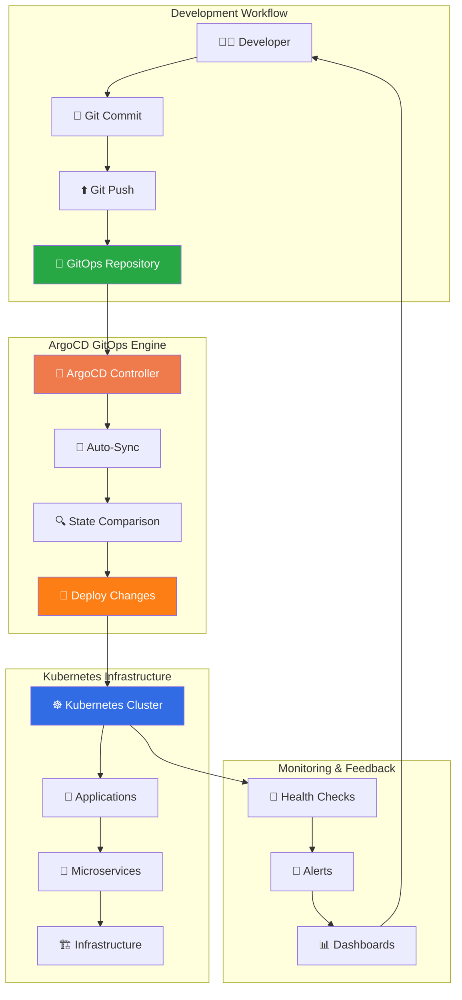

### ArgoCD App of Apps Architecture

```mermaid
graph TB
    subgraph "ArgoCD Management"
        ROOT[🎯 App of Apps<br/>nexus-commerce-app-of-apps]
        ROOT --> INFRA_APP[🏗️ Infrastructure App<br/>nexus-infrastructure]
        ROOT --> MICRO_APP[🔧 Microservices App<br/>nexus-microservices]
        ROOT --> DATA_APP[💾 Data Layer App<br/>nexus-data-layer]
        ROOT --> OBS_APP[📊 Observability App<br/>nexus-observability]
        ROOT --> INGRESS_APP[🌐 Ingress App<br/>nexus-ingress]
    end
    
    subgraph "Infrastructure Layer"
        INFRA_APP --> CONFIG[⚙️ Config Server<br/>Port: 8888]
        INFRA_APP --> EUREKA[🗺️ Eureka Server<br/>Port: 8761]
        INFRA_APP --> GATEWAY[🌐 API Gateway<br/>Port: 8099]
    end
    
    subgraph "Microservices Layer"
        MICRO_APP --> USER[👤 User Service<br/>Port: 8080]
        MICRO_APP --> PRODUCT[📦 Product Service<br/>Port: 8081]
        MICRO_APP --> CART[🛒 Cart Service<br/>Port: 8082]
        MICRO_APP --> ORDER[📋 Order Service<br/>Port: 8083]
    end
    
    subgraph "Data Layer"
        DATA_APP --> POSTGRES[🐘 PostgreSQL<br/>Port: 5432]
        DATA_APP --> REDIS[🔴 Redis<br/>Port: 6379]
        DATA_APP --> KAFKA[📡 Apache Kafka<br/>Port: 9092]
    end
    
    subgraph "Ingress & Networking"
        INGRESS_APP --> NGINX[🌐 NGINX Ingress<br/>Ports: 80/443]
        NGINX --> LB[⚖️ Load Balancer]
    end
    
    subgraph "Observability Stack"
        OBS_APP --> PROMETHEUS[📈 Prometheus<br/>Port: 9090]
        OBS_APP --> GRAFANA[📊 Grafana<br/>Port: 3000]
        OBS_APP --> ZIPKIN[🔍 Zipkin<br/>Port: 9411]
    end

    style ROOT fill:#e1f5fe,stroke:#01579b,stroke-width:3px
    style INFRA_APP fill:#fff3e0,stroke:#e65100,stroke-width:2px
    style MICRO_APP fill:#f3e5f5,stroke:#4a148c,stroke-width:2px
    style DATA_APP fill:#e8f5e8,stroke:#1b5e20,stroke-width:2px
    style OBS_APP fill:#fce4ec,stroke:#880e4f,stroke-width:2px
    style INGRESS_APP fill:#f1f8e9,stroke:#33691e,stroke-width:2px
```

## 📁 Repository Structure

```
gitops-repo_ArgoCD/
│
├── 📁 argocd/                          # ArgoCD application definitions
│   ├── 📁 applications/                # App of Apps pattern
│   │   ├── app-of-apps.yaml           # Root application
│   │   ├── infrastructure.yaml        # Infrastructure apps
│   │   ├── microservices.yaml         # Microservices apps
│   │   ├── data-layer.yaml            # Data layer apps
│   │   └── observability.yaml         # Monitoring apps
│   └── 📁 bootstrap/                   # ArgoCD bootstrap configs
│
├── 📁 base/                            # Base Kustomize configurations
│   ├── 📁 infrastructure/             # Core infrastructure services
│   │   ├── 📁 api-gateway/            # API Gateway configs
│   │   ├── 📁 config-server/          # Config Server configs
│   │   ├── 📁 eureka-server/          # Service Discovery configs
│   │   └── 📁 ingress-nginx/          # Ingress Controller configs
│   ├── 📁 microservices/              # Microservices base configs
│   │   ├── 📁 user-service/           # User management service
│   │   └── 📁 product-service/        # Product catalog service
│   ├── 📁 data/                       # Data layer services
│   └── 📁 observability/              # Monitoring & logging
│
├── 📁 environments/                    # Environment-specific overlays
│   ├── 📁 dev/                        # Development environment
│   │   ├── 📁 infrastructure/         # Dev infrastructure overlays
│   │   ├── 📁 microservices/          # Dev microservices overlays
│   │   ├── 📁 data/                   # Dev data layer configs
│   │   └── 📁 observability/          # Dev monitoring configs
│   ├── 📁 staging/                    # Staging environment
│   └── 📁 production/                 # Production environment
│
└── README.md                          # This file
```

### 🎯 Configuration Strategy

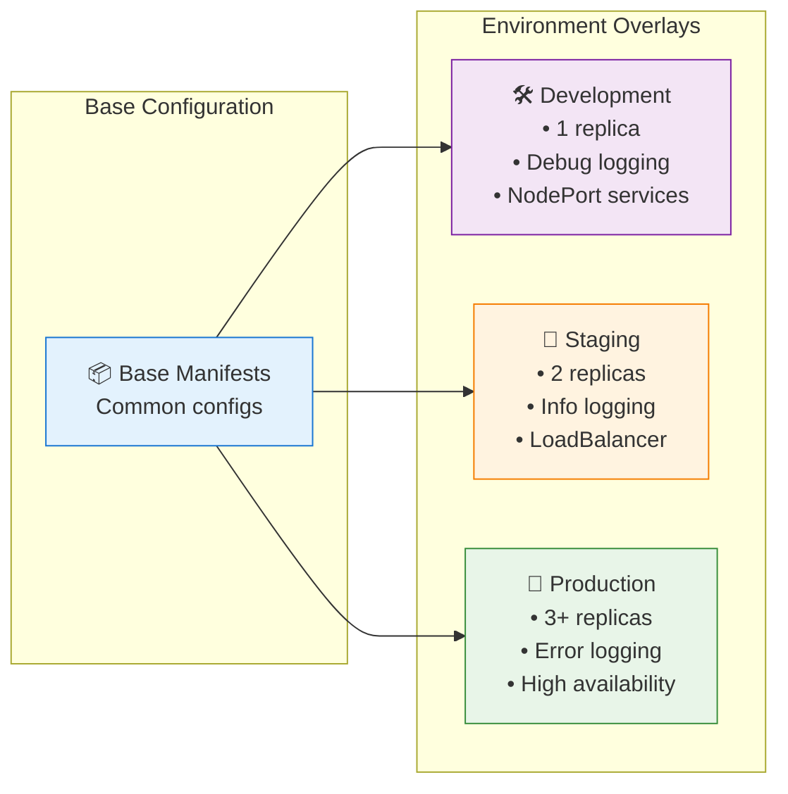

## 🎯 ArgoCD Applications

### App of Apps Pattern Implementation

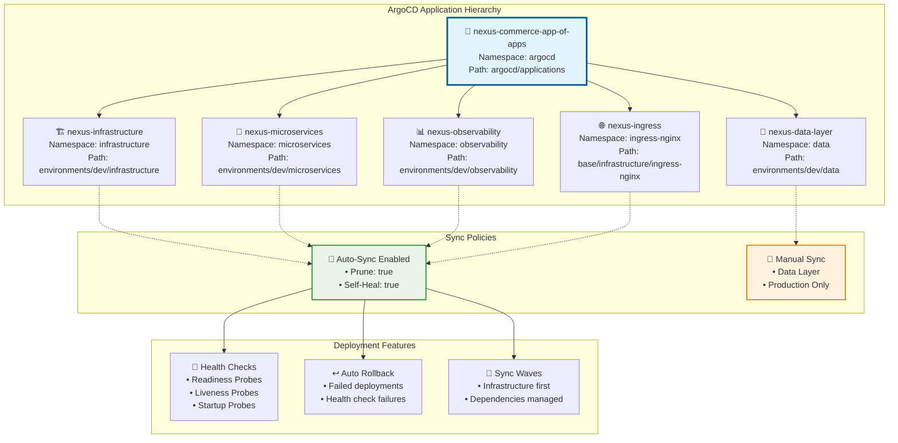

### Application Sync Strategy

| Application | Sync Policy | Prune | Self-Heal | Namespace | Notes |
|-------------|-------------|-------|-----------|-----------|--------|
| **App of Apps** | Auto | ✅ | ✅ | argocd | Root application manager |
| **Infrastructure** | Auto | ✅ | ✅ | infrastructure | Core services foundation |
| **Microservices** | Auto | ✅ | ✅ | microservices | Business logic services |
| **Ingress** | Auto | ✅ | ✅ | ingress-nginx | Traffic management |
| **Observability** | Auto | ✅ | ✅ | observability | Monitoring & alerting |
| **Data Layer** | Manual | ❌ | ❌ | data | Requires careful management |

## 🚀 Quick Start

### Prerequisites


- Kubernetes cluster (v1.28+)
- ArgoCD installed and configured
- kubectl configured for your cluster
- Git repository access

### 1. 🏗️ Install ArgoCD (if not already installed)

```bash
# Create ArgoCD namespace
kubectl create namespace argocd

# Install ArgoCD
kubectl apply -n argocd -f https://raw.githubusercontent.com/argoproj/argo-cd/stable/manifests/install.yaml

# Wait for ArgoCD to be ready
kubectl wait --for=condition=available --timeout=300s deployment/argocd-server -n argocd

# Get ArgoCD admin password
kubectl -n argocd get secret argocd-initial-admin-secret -o jsonpath="{.data.password}" | base64 -d
```

### 2. 🔧 Access ArgoCD UI

```bash
# Port forward to access ArgoCD UI
kubectl port-forward svc/argocd-server -n argocd 8080:443

# Open browser to https://localhost:8080
# Username: admin
# Password: (from previous step)
```

### 3. 🚀 Deploy App of Apps

```bash
# Apply the root App of Apps application
kubectl apply -f argocd/applications/app-of-apps.yaml

# Verify the application is created
argocd app list
```

### 4. 📊 Monitor Deployment

```bash
# Watch ArgoCD applications
argocd app list

# Check application health
argocd app get nexus-commerce-app-of-apps

# View sync status
argocd app sync nexus-commerce-app-of-apps
```

## 🏗️ Deployment Layers

### Infrastructure Layer Deployment Flow

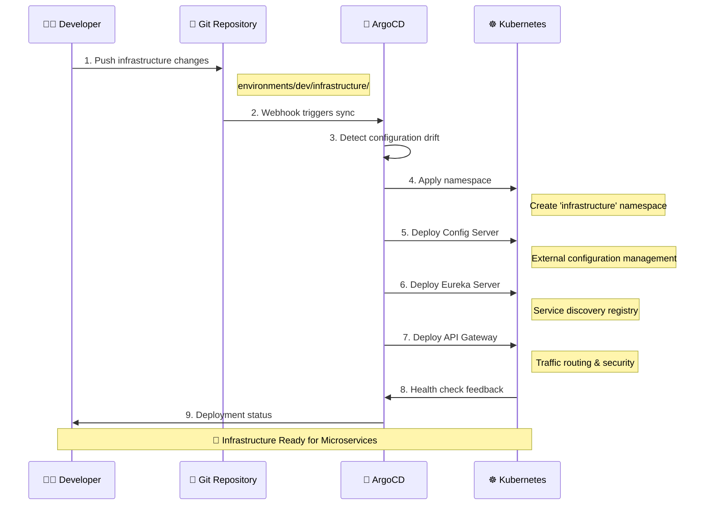

### Service Dependencies & Startup Order

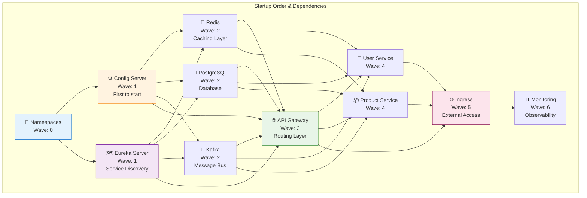

## 🌍 Environment Management

### Environment Configuration Matrix

| Component | Development | Staging | Production |
|-----------|------------|---------|------------|
| **Replicas** | 1 | 2 | 3+ |
| **Resources** | Minimal | Medium | High |
| **Logging** | DEBUG | INFO | ERROR |
| **Service Type** | NodePort | LoadBalancer | LoadBalancer |
| **Ingress** | Local domains | Staging domains | Production domains |
| **Database** | Single instance | HA pair | HA cluster |
| **Auto-scaling** | Disabled | Basic | Advanced |
| **Monitoring** | Basic | Full | Enterprise |

### Environment-Specific Kustomization

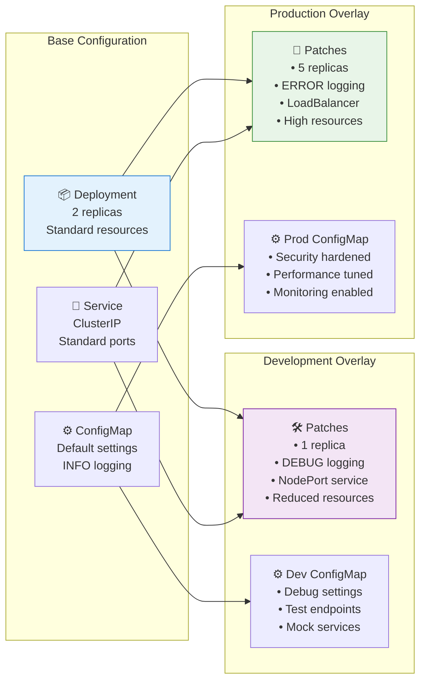

## 📊 Monitoring & Health Checks

### ArgoCD Application Health Dashboard

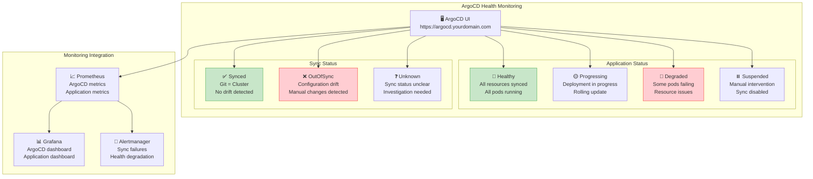

### Health Check Endpoints

| Service | Health Endpoint | Port | ArgoCD Health Check |
|---------|----------------|------|-------------------|
| **Config Server** | `/actuator/health` | 8888 | ✅ Spring Boot Actuator |
| **Eureka Server** | `/actuator/health` | 8761 | ✅ Spring Boot Actuator |
| **API Gateway** | `/actuator/health` | 8099 | ✅ Spring Boot Actuator |
| **User Service** | `/actuator/health` | 8080 | ✅ Spring Boot Actuator |
| **Product Service** | `/actuator/health` | 8081 | ✅ Spring Boot Actuator |
| **ArgoCD** | `/healthz` | 443 | ✅ ArgoCD Native |

## 🔧 Troubleshooting

### Common Issues & Solutions

#### 🚨 Application Stuck in Progressing State

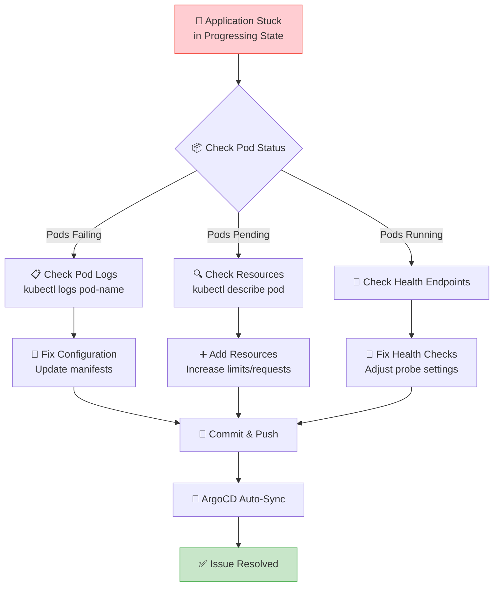

#### 🔍 Debugging Commands

```bash
# Check ArgoCD application status
argocd app get <app-name>

# View application logs
argocd app logs <app-name>

# Force refresh application
argocd app sync <app-name> --force

# Check Kubernetes events
kubectl get events --sort-by='.lastTimestamp' -n <namespace>

# Describe problematic resources
kubectl describe deployment <deployment-name> -n <namespace>

# Check pod logs
kubectl logs -f deployment/<deployment-name> -n <namespace>

# Restart deployment
kubectl rollout restart deployment/<deployment-name> -n <namespace>
```

### Sync Failure Troubleshooting

| Error Type | Symptoms | Solution |
|------------|----------|----------|
| **Resource Conflict** | `resource already exists` | Enable prune or delete conflicting resources |
| **Permission Denied** | `forbidden: access denied` | Check RBAC permissions for ArgoCD |
| **Invalid Manifest** | `error validating data` | Validate YAML syntax and Kubernetes API |
| **Hook Failure** | `hook job failed` | Check pre/post sync hooks and fix scripts |
| **Health Check Timeout** | `health check timeout` | Adjust health check timeouts or fix app health |

## 🎯 GitOps Best Practices

### 1. 📝 Commit Message Convention

```
<type>(<scope>): <description>

Types:
- feat: New feature or application
- fix: Bug fix or configuration correction
- refactor: Code/config restructuring
- docs: Documentation updates
- chore: Maintenance tasks

Examples:
feat(microservices): add cart service deployment
fix(infrastructure): correct eureka server health check
refactor(kustomize): reorganize base configurations
```

### 2. 🔄 Branching Strategy

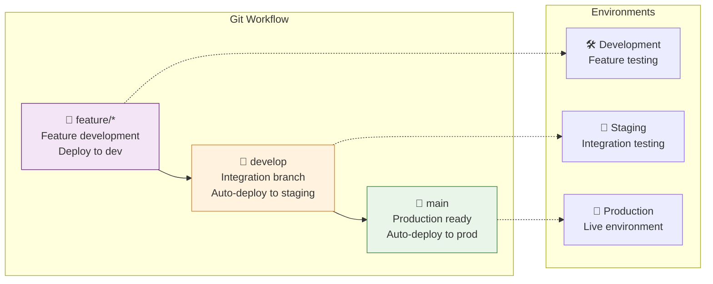

### 3. 🔒 Security Considerations

- **🔐 Secrets Management**: Use Kubernetes secrets or external secret managers
- **🔑 RBAC**: Implement least-privilege access controls
- **📝 Audit Logging**: Enable comprehensive audit trails
- **🔍 Vulnerability Scanning**: Regular container and manifest scanning
- **🚫 No Sensitive Data**: Never commit sensitive information

## 🚀 Advanced Features

### Progressive Delivery with ArgoCD

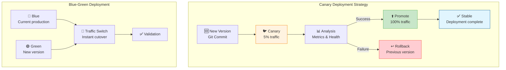

### Multi-Cluster Management

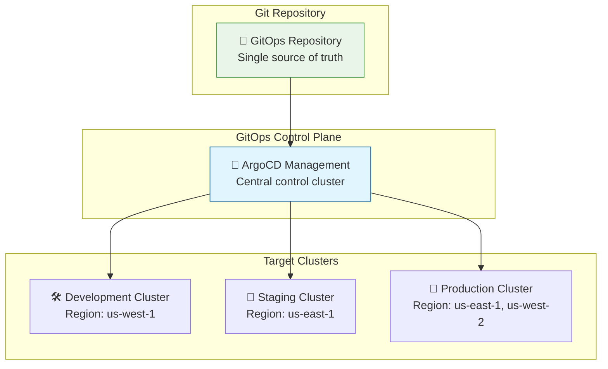

## 🤝 Contributing

### Contributing Workflow

1. **🍴 Fork** the repository
2. **🌿 Create** a feature branch (`git checkout -b feature/amazing-feature`)
3. **📝 Commit** your changes (`git commit -m 'feat(scope): add amazing feature'`)
4. **🚀 Push** to the branch (`git push origin feature/amazing-feature`)
5. **📝 Open** a Pull Request

### Pull Request Guidelines

- **✅ Validate** all Kubernetes manifests
- **🧪 Test** in development environment first
- **📖 Update** documentation if needed
- **🔍 Include** ArgoCD sync status screenshots
- **📋 Follow** commit message conventions

### Environment Promotion Process

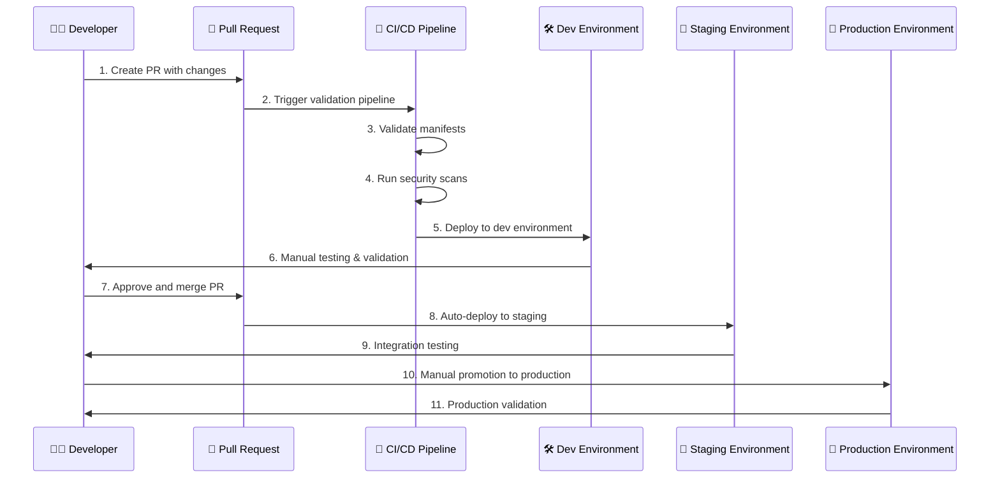

## 📚 Additional Resources

### 🔗 Useful Links

- **📖 ArgoCD Documentation**: [https://argo-cd.readthedocs.io/](https://argo-cd.readthedocs.io/)
- **⚙️ Kustomize Documentation**: [https://kustomize.io/](https://kustomize.io/)
- **☸️ Kubernetes Documentation**: [https://kubernetes.io/docs/](https://kubernetes.io/docs/)
- **🔧 GitOps Best Practices**: [https://opengitops.dev/](https://opengitops.dev/)

### 📞 Support & Community

- **🐛 Issues**: [GitHub Issues](https://github.com/ZakariaRek/gitops-repo_ArgoCD/issues)
- **💬 Discussions**: [GitHub Discussions](https://github.com/ZakariaRek/gitops-repo_ArgoCD/discussions)
- **📧 Email**: support@nexuscommerce.io
- **💬 Slack**: [Nexus Commerce DevOps](https://nexuscommerce.slack.com)

### 🏷️ Versioning & Releases

We use [Semantic Versioning](https://semver.org/) for our releases:

- **Major**: Breaking changes requiring manual intervention
- **Minor**: New features, backward compatible
- **Patch**: Bug fixes and security updates

## 📜 License

This project is licensed under the MIT License - see the [LICENSE](LICENSE) file for details.

---

<div align="center">

**🌟 Star this repository if it helped you! 🌟**

*"GitOps: Where Git becomes the single source of truth, and deployments become as simple as a git push."*


</div>
